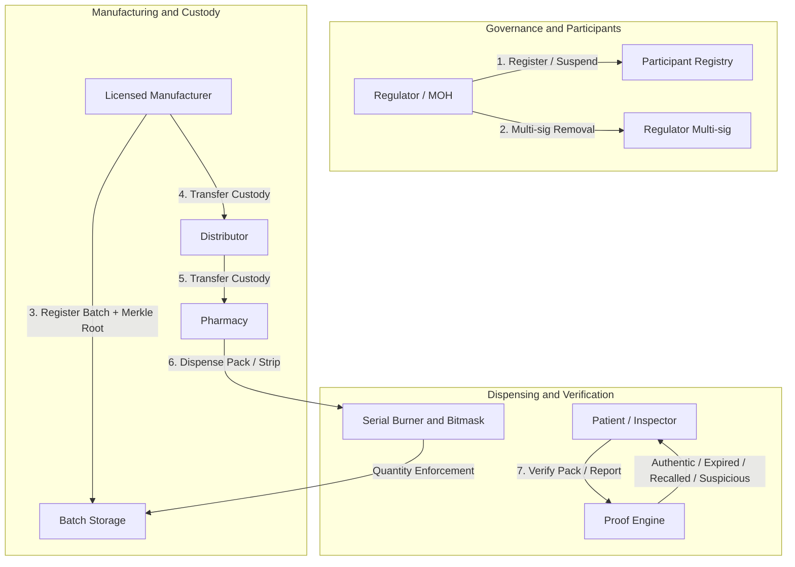

# Soroban Pharma RxProof — Smart Contracts

An enterprise-grade Stellar/Soroban smart contract platform securing pharmaceutical provenance, tracking custody transitions from manufacturers to retail pharmacies, enforcing batch quantities, preventing code cloning via serial burning, and providing cryptographic verification (authentic, expired, recalled, or suspicious) to patients, inspectors, and regulators.

---

## Architecture Overview



---

## Threat Model & Security Protections

### 1. Serial Cloning & Replay Attacks
- **Threat**: Counterfeiters purchase a legitimate pack of medicine, duplicate its QR code / serial onto thousands of counterfeit medicine packs, and circulate them in the market.
- **Contract Mitigation**:
  - **Single Full Pack Burn**: Dispensing a pack permanently marks `SerialDispensed(batch_id, serial_hash)` in persistent storage. Any subsequent attempt to dispense fails with `Error::SerialAlreadyDispensed`.
  - **Clone Detection on Verification**: Once burned, any consumer scanning the serial receives `VerificationResult::Suspicious` rather than `Authentic`, preventing cloned packs from passing verification.
  - **Blister / Strip Bitmask Tracking**: For medicines sold in divided blister strips (e.g., 2 or 3 strips per pack), individual strips are tracked in a compact 32-bit bitmask (`1 << strip_index`). Dispensing the same strip twice is rejected with `Error::StripAlreadyDispensed`. When all strips are dispensed, the entire pack serial is automatically burned.

### 2. Insider Supply Chain Fraud
- **Threat**: A rogue distributor attempts to divert legitimate packs or insert counterfeit packs without custody, or an unauthorized pharmacy attempts to dispense packs it never received.
- **Contract Mitigation**:
  - **Strict Custody Enforcement**: `transfer_custody` and `dispense_pack` verify `caller == batch.current_custody`. An actor cannot transfer or dispense a batch unless they are the verified on-chain custodian.
  - **Role-Gated Transitions**: Custody transitions follow strict supply chain hierarchy: `Manufacturer -> Distributor/Pharmacy`, `Distributor -> Distributor/Pharmacy`, and `Pharmacy -> Pharmacy`.
  - **Participant Registry**: Only regulators can onboard participants (`ParticipantRole::Manufacturer`, `ParticipantRole::Distributor`, `ParticipantRole::Pharmacy`). Inactive or suspended actors are blocked from receiving custody or dispensing.

### 3. Proof Malleability & Preimage Collisions
- **Threat**: Malicious actors craft fake Merkle proofs by exploiting commutativity or tree structure malleability.
- **Contract Mitigation**:
  - **Sorted-Pair Hashing**: Every internal Merkle node is computed as $H(\min(A, B) \parallel \max(A, B))$. Lexicographical ordering guarantees that proof validation is deterministic and resistant to left/right position tampering.
  - **Proof Length Cap**: Enforces `proof.len() <= 32` (`MAX_PROOF_DEPTH`), preventing gas/CPU exhaustion attacks while accommodating batches of up to $2^{32} \approx 4.29$ billion packs.

### 4. Rogue Regulator Takeover
- **Threat**: A compromised regulator credential attempts to unilaterally deregister legitimate oversight bodies or shut down the supply chain.
- **Contract Mitigation**:
  - **Multi-Signature Regulator Removal**: Removing an active regulator requires an on-chain proposal and consensus approval from a strict majority of regulators ($\lfloor N / 2 \rfloor + 1$).
  - **Last Regulator Protection**: The contract prohibits removing the last remaining regulator.

### 5. Spam Reports & Sybil Flagging
- **Threat**: An attacker spams suspicious reports to grief legitimate batches.
- **Contract Mitigation**:
  - `report_suspicious` requires caller authorization (`caller.require_auth()`), binding report submissions to an accountable Stellar address and emitting structured audit events indexed by regulator surveillance tools.

---

## Core Contract Interface

### Administration & Governance
- `initialize(env, admin: Address)`: Configures the initial contract administrator and registers the admin as the first regulator.
- `add_regulator(env, caller: Address, new_regulator: Address)`: Adds an active regulator (admin or active regulator auth required).
- `propose_remove_regulator(env, caller: Address, regulator_to_remove: Address) -> u64`: Creates a multi-sig proposal to remove a regulator.
- `approve_remove_regulator(env, caller: Address, proposal_id: u64)`: Casts a vote toward the required multi-sig consensus threshold.
- `pause(env, caller: Address)`: Halts supply chain state mutations during security incidents.
- `unpause(env, caller: Address)`: Resumes contract operations.

### Supply Chain Lifecycle
- `register_participant(env, caller: Address, participant: Address, role: ParticipantRole, metadata_hash: BytesN<32>)`: Onboards a participant.
- `set_participant_active(env, caller: Address, participant: Address, active: bool)`: Activates or suspends a participant.
- `register_batch(env, caller: Address, batch_id: BytesN<32>, merkle_root: BytesN<32>, total_quantity: u32, packaging_spec: PackagingSpec, expiry_timestamp: u64, metadata_hash: BytesN<32>)`: Registers a batch on-chain.
- `transfer_custody(env, caller: Address, batch_id: BytesN<32>, to: Address)`: Transfers custody along verified supply chain actors.
- `recall_batch(env, caller: Address, batch_id: BytesN<32>, reason: Symbol)`: Recalls a batch (callable by manufacturer, active regulator, or admin).

### Verification & Dispense
- `verify_pack(env, batch_id: BytesN<32>, serial_hash: BytesN<32>, merkle_proof: Vec<BytesN<32>>, strip_index: Option<u32>) -> VerificationResult`: Public verification query returning `Authentic`, `Expired`, `Recalled`, `Suspicious`, or `Invalid`.
- `dispense_pack(env, caller: Address, batch_id: BytesN<32>, serial_hash: BytesN<32>, merkle_proof: Vec<BytesN<32>>, strip_index: Option<u32>)`: Burns a pack or blister strip at an authorized pharmacy, enforcing total quantity caps.
- `report_suspicious(env, caller: Address, batch_id: BytesN<32>, serial_hash: BytesN<32>, reason: Symbol)`: Submits a counterfeit or tampering report.

---

## Local Development & Testing

### Prerequisites
- Rust stable (`>= 1.80`) with `wasm32-unknown-unknown` target
- Stellar CLI (`>= 22.0.0`)
- Node.js (`>= 20.0.0`)

### Running Unit Tests
```bash
cargo test
```

### Building WASM
```bash
stellar contract build
# Or directly with Cargo:
cargo build --target wasm32-unknown-unknown --release
```

### Deploying to Stellar Testnet
```powershell
# PowerShell
.\scripts\deploy-testnet.ps1

# Bash
./scripts/deploy-testnet.sh
```

### Generating TypeScript SDK
```powershell
# PowerShell
.\scripts\build-bindings.ps1

# Bash
./scripts/build-bindings.sh
```

---

## License
Apache-2.0
